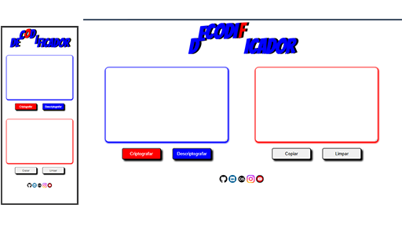

# Decodificador de Texto

### Desafio Challenge Curso Alura

###### Desafio: Criar uma aplicação que codifique palavras sendo uma das regras aceitar somente letras minusculas e palavras sem acentos usando HTML CSS e JavaScript

## 👁️‍🗨️ Preview

Link para visualizar: [Ver Demostração na Pratica](https://sandra-silva-santos.github.io/Alura_Decodificador/)

## 🛠️ **Tecnologias**

  
